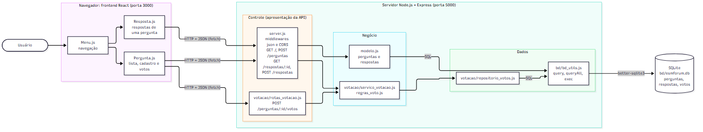

# Arquitetura do ESM Forum

A análise considera o sistema como está neste fork, já com a votação implementada. Onde a votação mudou a organização original, isso é indicado.

## 1. Identificação da arquitetura

### 1.1 Estilos arquiteturais

O ESM Forum combina três estilos:

- Cliente-servidor. O frontend React roda no navegador (cliente) e faz requisições ao backend Node.js (servidor), que é o único com acesso ao banco. São dois processos e dois repositórios separados: `esmforum-react`, servido na porta 3000 pelo servidor de desenvolvimento, e `esmforum`, na porta 5000.
- API REST com Single Page Application. O backend não gera HTML: expõe recursos (`/perguntas`, `/respostas`, `/perguntas/:id/votos`) acessados com os métodos HTTP e devolve JSON. O frontend é uma SPA, que carrega uma vez e troca de página pelo `react-router-dom`, sem recarregar, buscando os dados na API.
- MVC, na variação descrita em `docs/arquitetura.md` do próprio repositório: a Visão é o frontend React, o Controlador é `server.js` e o Modelo é `modelo.js`. É a variação comum em aplicações web atuais, em que a Visão está em outro processo e fala com o Controlador por HTTP, em vez de ser um template renderizado no servidor.

### 1.2 Camadas

| Camada | Onde fica | Responsabilidade |
|--------|-----------|------------------|
| Apresentação (interface) | `esmforum-react/src/pages/*.js` | Exibir perguntas, respostas e votos, capturar o que o usuário digita e clica, chamar a API. |
| Apresentação da API (controle) | `server.js`, `votacao/rotas_votacao.js` | Receber a requisição HTTP, extrair parâmetros, chamar o modelo ou o serviço, devolver JSON e o código de status. |
| Negócio | `modelo.js` (perguntas e respostas), `votacao/servico_votacao.js` e `votacao/regras_voto.js` | Regras do fórum: autor da pergunta, contagem de respostas, regras de voto e ordenação por placar. |
| Dados | `bd/bd_utils.js`, `votacao/repositorio_votos.js`, `bd/schema.sql` | Executar SQL e converter linhas em objetos. |
| Banco | `bd/esmforum.db` (SQLite) | Tabelas `perguntas`, `respostas` e `votos`. |

A separação é clara em quatro das cinco camadas. A exceção é `modelo.js`, que ocupa ao mesmo tempo a camada de negócio e a de dados: as regras e o SQL estão nas mesmas funções (ver `ANALISE_SOLID.md`, seção 2.1). A votação já segue as camadas separadas, com serviço e repositório em arquivos distintos. Perguntas e respostas ainda não.

### 1.3 Comunicação entre frontend e backend

O frontend chama o backend com `fetch`, enviando e recebendo JSON por HTTP:

| Método e caminho | Enviado | Recebido |
|------------------|---------|----------|
| `GET /?id_usuario=1` | nada | lista de perguntas com `num_respostas`, `placar` e `voto_usuario`, ordenada pelo placar |
| `POST /perguntas` | `{"pergunta": "texto"}` | `{"id_pergunta": 7}` |
| `GET /respostas/:id_pergunta` | nada | `{"pergunta": {...}, "respostas": [...]}` |
| `POST /respostas` | `{"id_pergunta": 7, "resposta": "texto"}` | `{"id_resposta": 3}` |
| `POST /perguntas/:id_pergunta/votos` | `{"id_usuario": 1, "valor": 1}` | `{"id_pergunta": 7, "placar": 1, "voto_usuario": 1}` |

`docs/arquitetura.md`, herdado do repositório original, descreve a rota de respostas como `GET /respostas/?id_pergunta=n`, mas o código usa o identificador no caminho (`/respostas/:id_pergunta`), como na tabela acima.

Como frontend e backend estão em portas diferentes, o navegador trata as chamadas como de outra origem. O middleware de CORS em `server.js` autoriza essas chamadas com o cabeçalho `Access-Control-Allow-Origin: *`. O endereço `http://localhost:5000` está escrito diretamente em cada `fetch` do frontend. Não há autenticação: o `id_usuario` é fixo em 1, no backend para perguntas e no frontend para votos.

## 2. Diagrama arquitetural

Fonte: [arquitetura_atual.mmd](diagramas/arquitetura_atual.mmd)

O fluxo de dados vai da esquerda para a direita. O usuário interage com as páginas React, que fazem requisições HTTP com JSON ao backend. No servidor, a requisição passa pelos middlewares e chega à rota. A rota chama o modelo, no caso de perguntas e respostas, ou o serviço de votação. O modelo acessa `bd_utils.js` diretamente com SQL. O serviço de votação passa pelo repositório, que também usa `bd_utils.js`. `bd_utils.js` é o único ponto que fala com o SQLite. A resposta faz o caminho inverso e volta ao navegador em JSON, onde o React atualiza o estado e a tela.

A diferença entre os dois caminhos no diagrama (o modelo indo direto ao banco e a votação passando por serviço e repositório) é a principal inconsistência da arquitetura atual, e é o ponto de partida de `PROPOSTA_ARQUITETURA.md`.
