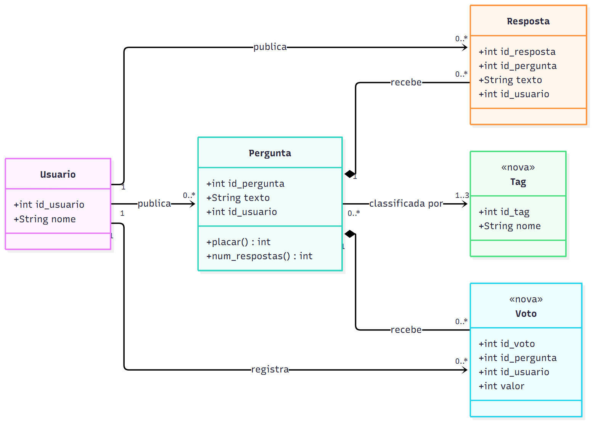
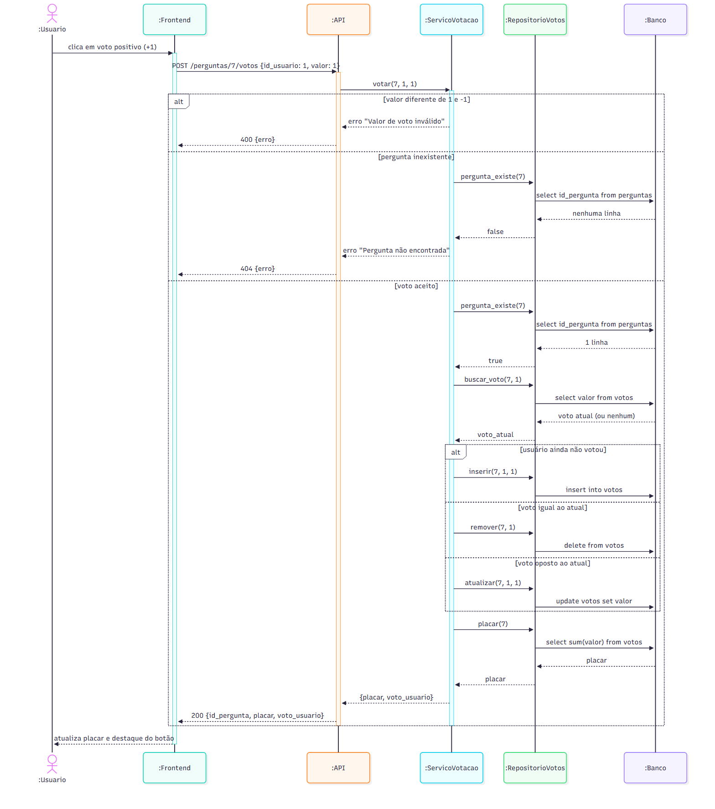
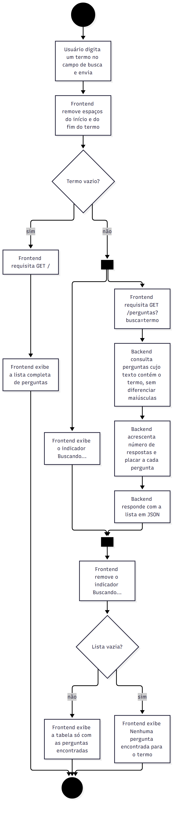
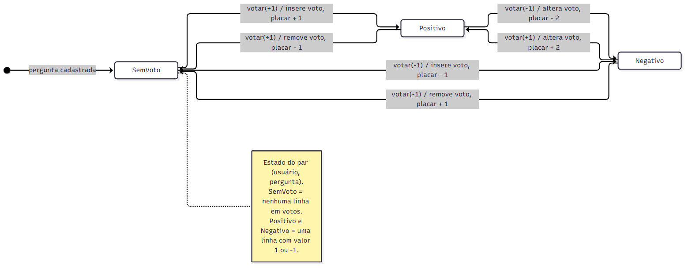

# Diagramas UML

Os quatro diagramas foram feitos em Mermaid, usando UML como esboço: mostram a estrutura e o comportamento das extensões propostas, sem detalhar o que não ajuda a entendê-las. Os arquivos fonte (`.mmd`) e as imagens (`.png`) estão na pasta `diagramas/`. As imagens foram geradas com o mermaid-cli:

```bash
npx -p @mermaid-js/mermaid-cli mmdc -i diagramas/diagrama_classes.mmd -o diagramas/diagrama_classes.png -b white -s 2
```

## 1. Diagrama de Classes



Fonte: [diagrama_classes.mmd](diagramas/diagrama_classes.mmd)

`Pergunta` e `Resposta` correspondem às tabelas atuais. `Usuario` ainda não é uma tabela, porque hoje o sistema só grava `id_usuario = 1` nas perguntas, mas aparece no diagrama porque a votação precisa distinguir quem votou. `Resposta` ganha o atributo `id_usuario`, que não existe no esquema atual e que o perfil de usuário vai exigir. As classes novas estão marcadas com o estereótipo `<<nova>>`: `Voto` guarda o valor (+1 ou -1) que um usuário deu a uma pergunta, e `Tag` é uma categoria da lista fixa da História 3. As composições indicam que respostas e votos não existem sem a pergunta. A associação entre `Pergunta` e `Tag` é muitos-para-muitos e, no banco, vira uma tabela de ligação `pergunta_tag`. O placar e o número de respostas aparecem como operações de `Pergunta` porque são calculados a partir dos votos e das respostas, não armazenados.

## 2. Diagrama de Sequência: votar em pergunta



Fonte: [diagrama_sequencia.mmd](diagramas/diagrama_sequencia.mmd)

Modela o caso de uso de `CASO_DE_USO.md`. O frontend envia o voto para a API, que repassa ao `ServicoVotacao`, onde ficam as regras. O serviço acessa o banco apenas pelo `RepositorioVotos`. O primeiro fragmento `alt` separa as duas exceções (valor inválido e pergunta inexistente) do voto aceito. O fragmento interno cobre os três casos do voto aceito: inserir um voto novo, remover um voto repetido (cancelamento) ou atualizar um voto oposto (troca). Nos três casos, o placar é recalculado com `sum(valor)` antes da resposta.

## 3. Diagrama de Atividades: buscar perguntas



Fonte: [diagrama_atividades.mmd](diagramas/diagrama_atividades.mmd)

Modela a busca por palavra-chave da História 2. A primeira decisão trata o termo vazio, que volta a exibir a lista completa. As barras pretas marcam um fluxo paralelo: enquanto o backend executa a consulta, o frontend exibe o indicador "Buscando...", e as duas atividades se juntam antes da exibição do resultado. A última decisão separa a lista com resultados da mensagem de nenhuma pergunta encontrada. O Mermaid não tem um tipo específico para diagramas de atividades, então foi usado um fluxograma com a notação de início e fim (círculos pretos), decisão (losango) e fork/join (barras).

## 4. Diagrama de Estados: voto de um usuário em uma pergunta



Fonte: [diagrama_estados.mmd](diagramas/diagrama_estados.mmd)

O objeto modelado é o voto de um usuário em uma pergunta, ou seja, o par (usuário, pergunta). Ele começa em `SemVoto` quando a pergunta é cadastrada. O mesmo evento `votar(valor)` leva a transições diferentes conforme o estado atual, e é isso que o diagrama deixa explícito: repetir o voto volta para `SemVoto` (cancelamento) e votar no sentido oposto passa direto de `Positivo` para `Negativo` ou o inverso (troca), com variação de 2 no placar. Cada transição mostra o evento e, depois da barra, a ação executada no banco e o efeito no placar.
