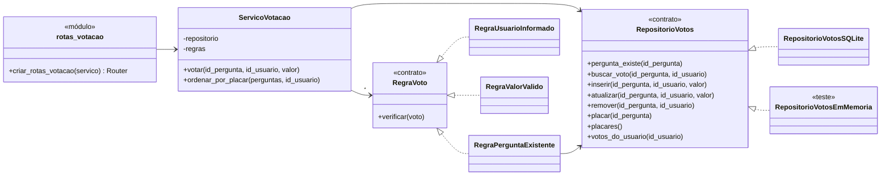

# Implementação com SOLID: votação em perguntas

A funcionalidade implementada é a votação em perguntas (História 1 de `HISTORIAS.md`, issue #1 do quadro), seguindo o caso de uso de `CASO_DE_USO.md`. Um usuário vota a favor (+1) ou contra (-1) uma pergunta. Repetir o voto o cancela, e votar no sentido oposto o troca. A página principal passa a exibir o placar de cada pergunta e a ordenar a lista pelo placar.

## 1. O que foi alterado

Backend (este repositório):

| Arquivo | Conteúdo |
|---------|----------|
| `bd/schema.sql`, `bd/votos.sql` | Tabela `votos`, com `unique (id_pergunta, id_usuario)` e `check (valor in (1, -1))`. `votos.sql` cria a tabela em bancos que já existiam. |
| `votacao/repositorio_votos.js` | `RepositorioVotosSQLite`: todo o SQL da votação. |
| `votacao/regras_voto.js` | `ErroVotacao` e as regras de validação do voto. |
| `votacao/servico_votacao.js` | `ServicoVotacao`: registrar, cancelar ou trocar o voto e ordenar perguntas pelo placar. |
| `votacao/rotas_votacao.js` | Rota `POST /perguntas/:id_pergunta/votos`. |
| `server.js` | Cria as instâncias da votação, registra a rota e acrescenta o placar ao `GET /`. |
| `testes/repositorio_votos.test.js`, `testes/servico_votacao.test.js` | 15 testes novos. |

Frontend (`esmforum-react`): `src/pages/Pergunta.js` ganhou a coluna Votos, com os botões de voto positivo e negativo, o placar e uma mensagem de erro quando o voto não é registrado.

API:

```
POST /perguntas/7/votos    {"id_usuario": 1, "valor": 1}
200 {"id_pergunta": 7, "placar": 3, "voto_usuario": 1}
400 {"erro": "Valor de voto inválido: use 1 ou -1"}
400 {"erro": "Usuário não informado"}
404 {"erro": "Pergunta não encontrada"}

GET /?id_usuario=1         cada pergunta traz também "placar" e "voto_usuario"
```

## 2. Estrutura



JavaScript não tem interfaces. Os contratos `RegraVoto` e `RepositorioVotos` existem como convenção: qualquer objeto com os mesmos métodos pode ser usado no lugar do outro. É assim que o teste do serviço usa um repositório em memória.

## 3. SRP: uma responsabilidade por módulo

Cada arquivo da pasta `votacao/` tem um único motivo para mudar:

- `repositorio_votos.js` muda se o esquema ou o banco mudarem. É o único arquivo da votação com SQL.
- `regras_voto.js` muda se as condições para aceitar um voto mudarem.
- `servico_votacao.js` muda se a regra de negócio da votação mudar (por exemplo, se o cancelamento deixar de existir).
- `rotas_votacao.js` muda se o formato da API mudar (URL, nomes dos campos, códigos de status).

A rota não contém regra de negócio, só converte a requisição em chamada ao serviço e o resultado em JSON:

```js
// votacao/rotas_votacao.js
rotas.post('/perguntas/:id_pergunta/votos', (req, res) => {
  try {
    const id_pergunta = Number(req.params.id_pergunta);
    const resultado = servico.votar(id_pergunta, req.body.id_usuario, req.body.valor);
    res.json({ id_pergunta: id_pergunta, placar: resultado.placar, voto_usuario: resultado.voto_usuario });
  }
  catch(erro) {
    const status = erro instanceof ErroVotacao ? erro.status : 500;
    res.status(status).json({ erro: erro.message });
  }
});
```

O serviço, por sua vez, não tem nenhuma linha de SQL nem conhece `req` e `res`:

```js
// votacao/servico_votacao.js
votar(id_pergunta, id_usuario, valor) {
  const voto = { id_pergunta: id_pergunta, id_usuario: id_usuario, valor: valor };
  this.regras.forEach(regra => regra.verificar(voto));

  const voto_atual = this.repositorio.buscar_voto(id_pergunta, id_usuario);
  let voto_usuario = valor;
  if (voto_atual === null) {
    this.repositorio.inserir(id_pergunta, id_usuario, valor);
  }
  else if (voto_atual === valor) {
    this.repositorio.remover(id_pergunta, id_usuario);
    voto_usuario = 0;
  }
  else {
    this.repositorio.atualizar(id_pergunta, id_usuario, valor);
  }

  return { placar: this.repositorio.placar(id_pergunta), voto_usuario: voto_usuario };
}
```

## 4. DIP: dependências recebidas, não importadas

`ServicoVotacao` não importa o repositório nem as regras. Recebe os dois pelo construtor e depende apenas dos métodos que chama. O repositório também não importa o banco, e o recebe pronto:

```js
// votacao/servico_votacao.js
class ServicoVotacao {
  constructor(repositorio, regras) {
    this.repositorio = repositorio;
    this.regras = regras;
  }

// votacao/repositorio_votos.js
class RepositorioVotosSQLite {
  constructor(bd) {
    this.bd = bd;
  }
```

As classes concretas são escolhidas em um único lugar, o início de `server.js`:

```js
// server.js
const repositorio_votos = new RepositorioVotosSQLite(bd);
const servico_votacao = new ServicoVotacao(repositorio_votos, [
  new regras.RegraUsuarioInformado(),
  new regras.RegraValorValido(),
  new regras.RegraPerguntaExistente(repositorio_votos)
]);
```

É isso que permite testar o serviço sem banco nenhum. Em `testes/servico_votacao.test.js`, o serviço recebe um `RepositorioVotosEmMemoria`, que guarda os votos em um array e tem os mesmos métodos do repositório SQLite. Já o repositório é testado em `testes/repositorio_votos.test.js` com um banco SQLite em memória, criado a partir de `schema.sql`, sem tocar em `esmforum.db` nem disputar `esmforum-teste.db` com os testes originais. Essa é a diferença em relação a `modelo.js`, que importa `bd_utils.js` e precisa de `reconfig_bd` para ser testado (ver seção 2.2 de `ANALISE_SOLID.md`).

## 5. OCP: novas regras sem alterar o serviço

As condições para aceitar um voto são objetos com o método `verificar(voto)`, passados ao serviço em uma lista:

```js
// votacao/regras_voto.js
class RegraValorValido {
  verificar(voto) {
    if (voto.valor !== 1 && voto.valor !== -1) {
      throw new ErroVotacao('Valor de voto inválido: use 1 ou -1', 400);
    }
  }
}

class RegraPerguntaExistente {
  constructor(repositorio) {
    this.repositorio = repositorio;
  }

  verificar(voto) {
    if (!this.repositorio.pergunta_existe(voto.id_pergunta)) {
      throw new ErroVotacao('Pergunta não encontrada', 404);
    }
  }
}
```

O serviço percorre a lista sem saber quais regras existem (`this.regras.forEach(regra => regra.verificar(voto))`). Quando houver login e perfil de usuário, uma regra como "o autor não pode votar na própria pergunta" é uma classe nova incluída na lista em `server.js`, e `ServicoVotacao` fica fechado para modificação. O último teste de `servico_votacao.test.js` demonstra isso com uma regra criada só no teste:

```js
// testes/servico_votacao.test.js
class RegraUsuarioBloqueado {
  verificar(voto) {
    if (voto.id_usuario === 666) {
      throw new regras.ErroVotacao('Usuário bloqueado', 403);
    }
  }
}
const servico_com_bloqueio = new ServicoVotacao(repositorio, [new RegraUsuarioBloqueado()]);
expect(() => servico_com_bloqueio.votar(1, 666, 1)).toThrow('Usuário bloqueado');
```

A extensão também vale para o armazenamento: trocar o SQLite por outro banco é escrever outro repositório com os mesmos métodos e mudar uma linha em `server.js`, sem alterar serviço, regras nem rotas.

## 6. LSP e ISP

Os outros dois princípios aparecem como consequência. `RepositorioVotosEmMemoria` substitui `RepositorioVotosSQLite` sem que o serviço perceba diferença: os testes do serviço rodam com o repositório em memória, e o servidor usa o mesmo serviço com o repositório SQLite (Substituição de Liskov). O contrato de regra tem um único método, então uma regra nova implementa só `verificar`, e a rota depende apenas de `votar`, sem enxergar o repositório (Segregação de Interfaces).

## 7. Como verificar

```bash
npm test
```

São 18 testes em 4 suítes: os 3 originais e os 15 da votação. Para testar pela interface, com o backend e o frontend rodando (ver `INSTALACAO.md`), a página principal mostra a coluna Votos. Clicar duas vezes no mesmo botão cancela o voto, e depois de recarregar a página a pergunta mais votada aparece primeiro. Quem usa um banco criado antes desta versão precisa criar a tabela com `sqlite3 bd/esmforum.db < bd/votos.sql`.
