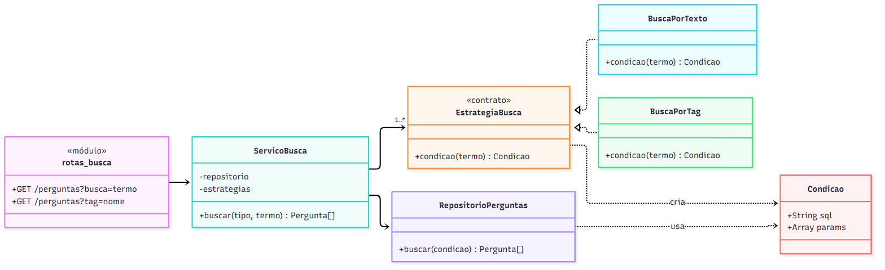
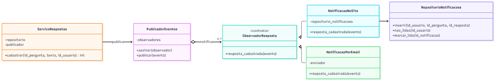
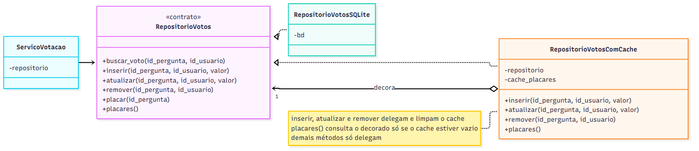

# Padrões de projeto propostos

Três padrões, um para cada problema concreto das funcionalidades pedidas pelo cliente:

| Padrão | Categoria | Funcionalidade | Problema |
|--------|-----------|----------------|----------|
| Strategy | comportamental | Busca e tags (issues #2 e #3) | vários critérios de busca sobre a mesma lista de perguntas |
| Observer | comportamental | Notificação de novas respostas (issue #5) | avisar interessados sem acoplar o cadastro de respostas a cada forma de aviso |
| Decorator | estrutural | Votação (issue #1, já implementada) | acrescentar cache ao cálculo de placares sem alterar o repositório nem o serviço |

As propostas seguem a organização usada na votação: rotas, serviço com as regras e repositório com o SQL, com as dependências montadas em `server.js`. Os fontes dos diagramas estão em `diagramas/`, e o código é JavaScript simplificado, sem tratamento de erro.

## 1. Strategy: critérios de busca

### 1.1 Justificativa e contexto

A História 2 pede busca por palavra-chave, e a História 3 pede filtro por tag. Com o perfil de usuário, virá também a busca por autor. Os três casos fazem a mesma coisa (devolver perguntas com número de respostas e placar, na mesma ordem) e diferem só no critério de seleção. Sem um padrão, a tendência é uma função de busca com um `if` por critério, que precisa ser editada a cada critério novo e mistura a montagem do SQL de todos eles.

O Strategy encapsula cada algoritmo intercambiável em uma classe com a mesma interface, e o cliente escolhe qual usar em tempo de execução. É adequado aqui porque os critérios variam de forma independente do resto da busca, e um critério novo deve entrar sem mexer nos existentes.

### 1.2 Proposta de solução



Fonte: [padrao_strategy_busca.mmd](diagramas/padrao_strategy_busca.mmd)

- `EstrategiaBusca` é o contrato: um método `condicao(termo)` que devolve o trecho `where` do SQL e os parâmetros dele.
- `BuscaPorTexto` gera `texto like ?` com o termo entre `%`. `BuscaPorTag` gera uma subconsulta em `pergunta_tag`.
- `RepositorioPerguntas.buscar(condicao)` monta a consulta completa (colunas, contagem de respostas, ordem) e aplica a condição recebida. O repositório não sabe qual critério foi usado.
- `ServicoBusca` recebe o repositório e um mapa de estratégias pelo construtor, normaliza o termo (remove espaços, trata termo vazio) e escolhe a estratégia pelo tipo pedido.
- A rota `GET /perguntas` lê `?busca=` ou `?tag=` e chama o serviço com o tipo correspondente.

Um critério novo, como busca por autor, é uma classe nova registrada no mapa em `server.js`, sem alteração em `ServicoBusca` nem em `RepositorioPerguntas`.

### 1.3 Exemplo de código

```js
// busca/estrategias_busca.js
class BuscaPorTexto {
  condicao(termo) {
    // O LIKE do SQLite já ignora maiúsculas em letras sem acento ("Python" e "python").
    // Letras acentuadas ("É" e "é") exigiriam a extensão ICU ou normalizar o texto em JavaScript.
    return { sql: 'p.texto like ?', params: ['%' + termo + '%'] };
  }
}

class BuscaPorTag {
  condicao(termo) {
    return {
      sql: `exists (select 1 from pergunta_tag pt join tags t on t.id_tag = pt.id_tag
                    where pt.id_pergunta = p.id_pergunta and t.nome = ?)`,
      params: [termo]
    };
  }
}

// busca/servico_busca.js
class ServicoBusca {
  constructor(repositorio, estrategias) {
    this.repositorio = repositorio;
    this.estrategias = estrategias;       // { texto: new BuscaPorTexto(), tag: new BuscaPorTag() }
  }

  buscar(tipo, termo) {
    const termo_limpo = (termo || '').trim();
    if (termo_limpo === '') {
      return this.repositorio.listar();
    }
    const condicao = this.estrategias[tipo].condicao(termo_limpo);
    return this.repositorio.buscar(condicao);
  }
}

// busca/repositorio_perguntas.js
buscar(condicao) {
  return this.bd.queryAll(
    `select p.*, count(r.id_resposta) as num_respostas
       from perguntas p left join respostas r on r.id_pergunta = p.id_pergunta
      where ${condicao.sql}
      group by p.id_pergunta`, condicao.params);
}

// server.js
const servico_busca = new ServicoBusca(new RepositorioPerguntas(bd), {
  texto: new BuscaPorTexto(),
  tag: new BuscaPorTag()
});
```

A condição é sempre um texto fixo definido pela estratégia, e o termo digitado entra só como parâmetro (`?`), então a interpolação em `where ${condicao.sql}` não abre espaço para injeção de SQL.

## 2. Observer: notificação de novas respostas

### 2.1 Justificativa e contexto

A funcionalidade 5 pede que o autor de uma pergunta seja avisado quando ela receber resposta. O ponto em que isso acontece é o cadastro de resposta, hoje em `modelo.cadastrar_resposta`. A solução direta seria acrescentar ali o código de notificação, e depois o de envio de email, e depois o de atualização do perfil. Cada forma de aviso nova editaria o cadastro de respostas, que passaria a depender de email, de tabela de notificações e do que mais surgir.

O Observer define uma dependência um-para-muitos: quando o objeto observado muda de estado, todos os observadores registrados são notificados, sem que o observado conheça as classes deles. É adequado porque o cadastro de resposta é um evento com vários interessados possíveis, que variam com o tempo, e o cadastro não deve depender de nenhum deles.

### 2.2 Proposta de solução



Fonte: [padrao_observer_notificacao.mmd](diagramas/padrao_observer_notificacao.mmd)

- `PublicadorEventos` guarda a lista de observadores (`assinar`) e repassa cada evento a todos eles (`publicar`).
- `ServicoRespostas.cadastrar` grava a resposta pelo repositório e publica o evento `resposta_cadastrada` com `id_pergunta`, `id_resposta` e `id_usuario` de quem respondeu. O serviço não conhece nenhum observador.
- `NotificacaoNoSite` busca o autor da pergunta e grava uma linha na tabela `notificacoes`, exceto quando o próprio autor respondeu. O frontend consulta `GET /notificacoes?id_usuario=` e mostra a quantidade de não lidas no menu.
- `NotificacaoPorEmail` é um segundo observador, para quando houver cadastro de email no perfil. Ele é incluído com uma chamada a `assinar` em `server.js`.

A comunicação é síncrona: `publicar` chama cada observador em sequência, dentro da mesma requisição. Um erro em um observador é registrado e não impede os outros nem desfaz a resposta cadastrada.

### 2.3 Exemplo de código

```js
// eventos/publicador_eventos.js
class PublicadorEventos {
  constructor() {
    this.observadores = [];
  }

  assinar(observador) {
    this.observadores.push(observador);
  }

  publicar(evento) {
    this.observadores.forEach(observador => {
      try {
        observador.resposta_cadastrada(evento);
      }
      catch(erro) {
        console.error('Falha ao notificar:', erro.message);
      }
    });
  }
}

// respostas/servico_respostas.js
class ServicoRespostas {
  constructor(repositorio, publicador) {
    this.repositorio = repositorio;
    this.publicador = publicador;
  }

  cadastrar(id_pergunta, texto, id_usuario) {
    const id_resposta = this.repositorio.inserir(id_pergunta, texto, id_usuario);
    this.publicador.publicar({ id_pergunta, id_resposta, id_usuario });
    return id_resposta;
  }
}

// notificacoes/notificacao_no_site.js
class NotificacaoNoSite {
  constructor(repositorio_perguntas, repositorio_notificacoes) {
    this.repositorio_perguntas = repositorio_perguntas;
    this.repositorio_notificacoes = repositorio_notificacoes;
  }

  resposta_cadastrada(evento) {
    const autor = this.repositorio_perguntas.autor(evento.id_pergunta);
    if (autor !== evento.id_usuario) {
      this.repositorio_notificacoes.inserir(autor, evento.id_pergunta, evento.id_resposta);
    }
  }
}

// server.js
const publicador = new PublicadorEventos();
publicador.assinar(new NotificacaoNoSite(repositorio_perguntas, repositorio_notificacoes));
const servico_respostas = new ServicoRespostas(repositorio_respostas, publicador);
```

## 3. Decorator: cache de placares na votação

### 3.1 Justificativa e contexto

Com a votação implementada, toda carga da página principal (`GET /`) chama `repositorio.placares()`, que executa `sum(valor) ... group by id_pergunta` sobre a tabela inteira de votos. A página é carregada muitas vezes mais do que se vota, então o mesmo resultado é recalculado repetidamente. Com o volume atual isso não é problema, e por isso o cache não foi implementado (ver `DESIGN_SIMPLES.md`). A proposta registra como ele seria acrescentado quando o número de votos crescer.

Colocar o cache dentro de `RepositorioVotosSQLite` misturaria acesso a dados e política de cache na mesma classe, e colocá-lo em `ServicoVotacao` misturaria regra de negócio e desempenho. O Decorator acrescenta comportamento a um objeto envolvendo-o em outro com a mesma interface, que delega as chamadas e faz algo antes ou depois. É adequado porque o cache é uma camada opcional sobre um objeto que já funciona, e quem usa o repositório não deve perceber a diferença.

### 3.2 Proposta de solução



Fonte: [padrao_decorator_cache.mmd](diagramas/padrao_decorator_cache.mmd)

- `RepositorioVotosComCache` tem os mesmos métodos do contrato `RepositorioVotos` e recebe no construtor o repositório que decora.
- `placares()` devolve o resultado guardado. Só consulta o repositório decorado quando o cache está vazio.
- `inserir`, `atualizar` e `remover` delegam ao decorado e esvaziam o cache, porque qualquer voto altera algum placar.
- Os demais métodos (`buscar_voto`, `placar`, `pergunta_existe`, `votos_do_usuario`) só delegam.
- Em `server.js`, o serviço passa a receber o repositório decorado. `ServicoVotacao` e `RepositorioVotosSQLite` não mudam.

O cache vale para um único processo do servidor, que é como o ESM Forum roda. Com mais de uma instância do servidor, seria preciso um cache compartilhado, e o mesmo decorator poderia usá-lo sem mudar sua interface.

### 3.3 Exemplo de código

```js
// votacao/repositorio_votos_com_cache.js
class RepositorioVotosComCache {
  constructor(repositorio) {
    this.repositorio = repositorio;
    this.cache_placares = null;
  }

  placares() {
    if (this.cache_placares === null) {
      this.cache_placares = this.repositorio.placares();
    }
    return this.cache_placares;
  }

  inserir(id_pergunta, id_usuario, valor) {
    this.repositorio.inserir(id_pergunta, id_usuario, valor);
    this.cache_placares = null;
  }

  atualizar(id_pergunta, id_usuario, valor) {
    this.repositorio.atualizar(id_pergunta, id_usuario, valor);
    this.cache_placares = null;
  }

  remover(id_pergunta, id_usuario) {
    this.repositorio.remover(id_pergunta, id_usuario);
    this.cache_placares = null;
  }

  pergunta_existe(id_pergunta)            { return this.repositorio.pergunta_existe(id_pergunta); }
  buscar_voto(id_pergunta, id_usuario)    { return this.repositorio.buscar_voto(id_pergunta, id_usuario); }
  placar(id_pergunta)                     { return this.repositorio.placar(id_pergunta); }
  votos_do_usuario(id_usuario)            { return this.repositorio.votos_do_usuario(id_usuario); }
}

// server.js: única linha alterada
const repositorio_votos = new RepositorioVotosComCache(new RepositorioVotosSQLite(bd));
```

Os testes de `servico_votacao.test.js` valeriam igualmente com o repositório decorado, porque ele cumpre o mesmo contrato.
