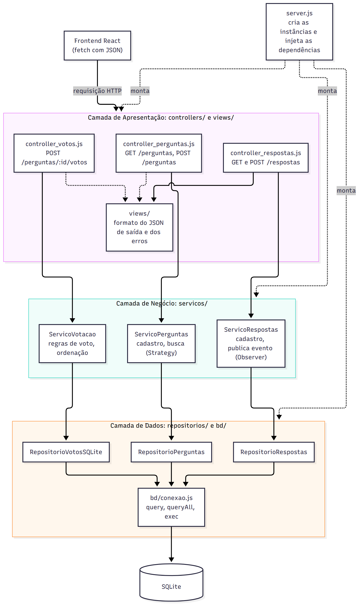
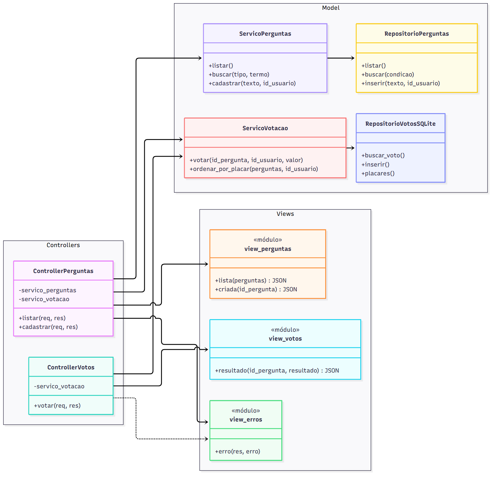
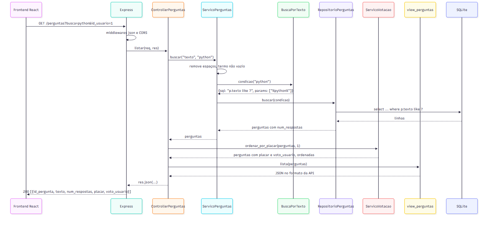

# Proposta de organização arquitetural

A arquitetura atual (`ARQUITETURA.md`) tem dois caminhos diferentes para a mesma coisa. Perguntas e respostas vão da rota direto para `modelo.js`, que mistura regras e SQL. A votação passa por rota, serviço e repositório em módulos separados. A proposta estende a organização da votação ao sistema inteiro, com três camadas e o padrão MVC no backend, de modo que as funcionalidades novas (busca, tags, perfil e notificação) já tenham um lugar definido.

## 1. Separação em camadas

### 1.1 Estrutura proposta

```
esmforum/
├── server.js                      composição: cria as instâncias, injeta dependências, registra rotas
├── controllers/                   camada de apresentação (entrada HTTP)
│   ├── controller_perguntas.js
│   ├── controller_respostas.js
│   └── controller_votos.js
├── views/                         camada de apresentação (formato da saída)
│   ├── view_perguntas.js
│   ├── view_respostas.js
│   ├── view_votos.js
│   └── view_erros.js
├── servicos/                      camada de negócio
│   ├── servico_perguntas.js
│   ├── servico_respostas.js
│   ├── servico_votacao.js         (hoje em votacao/)
│   ├── regras_voto.js             (hoje em votacao/)
│   └── estrategias_busca.js
├── repositorios/                  camada de dados
│   ├── repositorio_perguntas.js
│   ├── repositorio_respostas.js
│   └── repositorio_votos.js       (hoje em votacao/)
└── bd/
    ├── conexao.js                 (hoje bd_utils.js)
    ├── schema.sql
    └── esmforum.db
```

`modelo.js` deixa de existir: as regras vão para os serviços, e o SQL para os repositórios. Os arquivos da votação só mudam de pasta, porque já estão separados por responsabilidade.



Fonte: [proposta_camadas.mmd](diagramas/proposta_camadas.mmd)

### 1.2 Camada de Apresentação (controllers e views)

Responsabilidades:

- declarar as rotas (método HTTP e caminho);
- ler e converter parâmetros de `req.params`, `req.query` e `req.body` (por exemplo, `Number(req.params.id_pergunta)`);
- chamar um ou mais serviços;
- escolher o status HTTP e montar a resposta JSON pelas views;
- converter erros de negócio no status correspondente (400, 404) e erros inesperados em 500.

Exemplos: `controller_perguntas.js` (`GET /perguntas`, com busca opcional, e `POST /perguntas`), `controller_respostas.js`, `controller_votos.js` e `views/view_erros.js`.

A camada não contém SQL nem regras de negócio. A pergunta a fazer sobre qualquer linha desta camada é se ela mudaria caso a API trocasse de formato. Se a resposta for não, a linha está na camada errada.

### 1.3 Camada de Negócio (serviços)

Responsabilidades:

- regras de perguntas: autor da pergunta (hoje fixo em 1, depois vindo do login), tamanho mínimo do texto, tags permitidas e o padrão dúvidas-gerais;
- regras de respostas: resposta só em pergunta existente e publicação do evento de nova resposta (Observer de `PADROES_PROPOSTOS.md`);
- regras de votação: um voto por usuário, cancelamento, troca e ordenação por placar (já implementadas);
- busca: normalização do termo e escolha do critério (Strategy de `PADROES_PROPOSTOS.md`).

Exemplos: `ServicoPerguntas`, `ServicoRespostas`, `ServicoVotacao` e as regras em `regras_voto.js`.

A camada não conhece `req`, `res`, códigos HTTP nem SQL. Recebe e devolve valores e objetos JavaScript, e sinaliza erros de regra com uma exceção própria (como `ErroVotacao`), que carrega a mensagem e o status sugerido.

### 1.4 Camada de Dados (repositórios)

Responsabilidades:

- todo o SQL do sistema, com um repositório por tabela principal;
- converter linhas do banco em objetos simples (`{ id_pergunta, texto, ... }`);
- consultas agregadas que dependem do banco (contagem de respostas, soma de votos).

Exemplos: `RepositorioPerguntas` (`listar`, `buscar(condicao)`, `inserir`, `autor`), `RepositorioRespostas` (`listar_por_pergunta`, `inserir`) e `RepositorioVotosSQLite` (já implementado). `bd/conexao.js` substitui `bd_utils.js`: em vez de abrir o banco na importação, exporta uma função `criar_conexao(caminho)` que devolve o objeto com `query`, `queryAll` e `exec`.

### 1.5 Comunicação entre as camadas

As chamadas descem em uma única direção: controller chama serviço, serviço chama repositório, repositório chama a conexão. Nenhuma camada chama a de cima, e nenhuma pula uma camada (um controller nunca chama um repositório diretamente).

As dependências são passadas pelo construtor, como na votação. `server.js` é o único arquivo que conhece todas as classes concretas e monta o sistema de baixo para cima:

```js
// server.js
const bd = criar_conexao('./bd/esmforum.db');

const repositorio_perguntas = new RepositorioPerguntas(bd);
const repositorio_votos = new RepositorioVotosSQLite(bd);

const servico_perguntas = new ServicoPerguntas(repositorio_perguntas, {
  texto: new BuscaPorTexto(),
  tag: new BuscaPorTag()
});
const servico_votacao = new ServicoVotacao(repositorio_votos, [ ... ]);

app.use(criar_controller_perguntas(servico_perguntas, servico_votacao));
app.use(criar_controller_votos(servico_votacao));
```

Os dados que atravessam as camadas são objetos JavaScript simples. Os erros sobem como exceções e só são convertidos em HTTP na camada de apresentação.

## 2. Padrão MVC no backend

O MVC da proposta corresponde às camadas da seção 1: o Model é a camada de negócio mais a de dados, o Controller é a parte de entrada da camada de apresentação e a View é a parte de saída. Como a interface visual é o React, que está em outro repositório, a View do backend não gera HTML. Ela define o formato do JSON que o frontend recebe. Hoje esse formato é montado em cada rota, e os erros saem em dois formatos diferentes: as rotas originais devolvem só a mensagem (`res.status(500).json(erro.message)`) e a votação devolve `{ "erro": mensagem }`. Centralizar a saída nas views resolve essa inconsistência.



Fonte: [proposta_mvc.mmd](diagramas/proposta_mvc.mmd)

A aplicação do MVC é detalhada para duas funcionalidades: votação (já implementada) e busca de perguntas (proposta).

### 2.1 Models

Votação:

- Dados: o voto (`id_pergunta`, `id_usuario`, `valor`) e os valores derivados, que são o placar de cada pergunta e o voto do usuário atual.
- Operações: `ServicoVotacao.votar` (registrar, cancelar ou trocar), `ServicoVotacao.ordenar_por_placar` e as regras de validação. A persistência fica em `RepositorioVotosSQLite` (`buscar_voto`, `inserir`, `atualizar`, `remover`, `placar`, `placares`).

Busca de perguntas:

- Dados: a pergunta (`id_pergunta`, `texto`, `id_usuario`), com `num_respostas` calculado, e o critério de busca (tipo e termo).
- Operações: `ServicoPerguntas.buscar(tipo, termo)`, que normaliza o termo, trata o termo vazio e escolhe a estratégia, e `RepositorioPerguntas.buscar(condicao)`, que monta e executa a consulta.

### 2.2 Views

Cada view é um módulo de funções puras que recebem dados do Model e devolvem o objeto que vira JSON. Não acessam banco nem serviços.

```js
// views/view_perguntas.js
function item(pergunta) {
  return {
    id_pergunta: pergunta.id_pergunta,
    texto: pergunta.texto,
    num_respostas: pergunta.num_respostas,
    placar: pergunta.placar,
    voto_usuario: pergunta.voto_usuario
  };
}

function lista(perguntas) {
  return perguntas.map(item);
}

// views/view_votos.js
function resultado(id_pergunta, resultado) {
  return { id_pergunta: id_pergunta, placar: resultado.placar, voto_usuario: resultado.voto_usuario };
}

// views/view_erros.js
function erro(res, erro) {
  const status = erro.status || 500;
  res.status(status).json({ erro: erro.message });
}
```

A view de perguntas escolhe explicitamente os campos. Hoje, `select *` faz qualquer coluna nova da tabela aparecer na API sem que ninguém decida isso. A view de erros garante o mesmo formato `{ "erro": mensagem }` em todas as rotas.

### 2.3 Controllers

O controller recebe a requisição, converte os parâmetros, chama o Model e entrega o resultado à View. A única lógica permitida é a de controle: qual serviço chamar, com que parâmetros, e qual status devolver.

```js
// controllers/controller_votos.js
function criar_controller_votos(servico_votacao) {
  const rotas = express.Router();

  rotas.post('/perguntas/:id_pergunta/votos', (req, res) => {
    try {
      const id_pergunta = Number(req.params.id_pergunta);
      const r = servico_votacao.votar(id_pergunta, req.body.id_usuario, req.body.valor);
      res.json(view_votos.resultado(id_pergunta, r));
    }
    catch(e) {
      view_erros.erro(res, e);
    }
  });

  return rotas;
}

// controllers/controller_perguntas.js
function criar_controller_perguntas(servico_perguntas, servico_votacao) {
  const rotas = express.Router();

  rotas.get('/perguntas', (req, res) => {
    try {
      const tipo = req.query.tag ? 'tag' : 'texto';
      const termo = req.query.tag || req.query.busca;
      const id_usuario = Number(req.query.id_usuario) || null;
      const perguntas = servico_perguntas.buscar(tipo, termo);
      res.json(view_perguntas.lista(servico_votacao.ordenar_por_placar(perguntas, id_usuario)));
    }
    catch(e) {
      view_erros.erro(res, e);
    }
  });

  return rotas;
}
```

O controller da votação é praticamente o `votacao/rotas_votacao.js` atual, com a montagem do JSON e do erro movida para as views.

### 2.4 Fluxo completo: busca de perguntas



Fonte: [proposta_fluxo_mvc.mmd](diagramas/proposta_fluxo_mvc.mmd)

1. O usuário digita "python" no campo de busca, e o frontend envia `GET /perguntas?busca=python&id_usuario=1`.
2. O Express aplica os middlewares (`express.json` e CORS) e entrega a requisição a `ControllerPerguntas.listar`.
3. O controller identifica o tipo de busca (texto, porque não veio `tag`) e chama `ServicoPerguntas.buscar("texto", "python")`.
4. O serviço remove os espaços, verifica que o termo não é vazio e pede à estratégia `BuscaPorTexto` a condição, que é `p.texto like ?` com o parâmetro `%python%`.
5. O serviço passa a condição a `RepositorioPerguntas.buscar`, que executa no SQLite a consulta com a contagem de respostas e devolve as perguntas encontradas.
6. O controller passa as perguntas a `ServicoVotacao.ordenar_por_placar`, que acrescenta `placar` e `voto_usuario` e as ordena.
7. O controller entrega a lista a `view_perguntas.lista`, que monta o JSON com os campos definidos.
8. O Express responde `200` com o JSON, e o React atualiza a tabela. Se a lista vier vazia, o frontend mostra a mensagem de nenhuma pergunta encontrada (História 2).

Se o serviço lançar um erro de regra em qualquer passo, o `catch` do controller entrega o erro a `view_erros.erro`, e a resposta sai com o status do erro e o corpo `{ "erro": mensagem }`.

### 2.5 Ordem de migração

A reorganização pode ser feita em passos pequenos, cada um com os testes passando: primeiro `bd/conexao.js` com `criar_conexao`, depois as views, depois perguntas e respostas saindo de `modelo.js` para serviço e repositório, e por último a mudança dos arquivos de `votacao/` para as pastas de camada. O teste `testes/listar_perguntas.test.js`, que depende do número de chamadas a `bd.query` feitas por `modelo.js`, é substituído por testes do serviço com um repositório em memória, como já é feito na votação.
